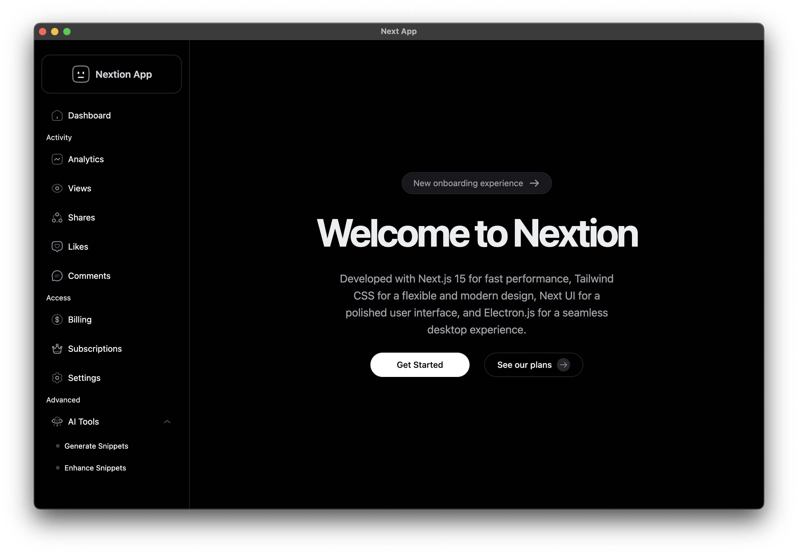

# NextJS + Tailwind CSS + Next UI + Electron Boilerplate



A simple and flexible boilerplate to build cross-platform desktop apps using **Electron** as the core and **NextJS** for the front-end. This template comes pre-configured with useful tools to speed up your development. Plus, it's set up with **TypeScript** from the start!

## Features ✨

- Pre-configured with **Tailwind CSS** for styling
- **Next UI** for beautiful and customizable UI components
- **Eslint** and **Prettier** for code formatting and linting
- **Electron Builder** for easy packaging and auto-updates
- **TypeScript** and **ESModules** supported by default
- Import aliases supported for both the main and renderer processes
- Clean, customizable project structure
- Easy-to-follow project layout
- Detailed npm scripts documentation

## Setting Up 🚀

This is a public template, so you can easily create a new repo from it. Afterward, clone your repo, install the dependencies with `yarn install`, and you’re good to go!

## Technologies Used 💻

- **Electron** for building cross-platform desktop apps
- **NextJS** for rendering the UI
- **Tailwind CSS** for utility-first styling
- **Next UI** for UI components
- **TypeScript** for type safety
- **Prettier** and **Eslint** for code formatting and linting
- **Electron Builder** for building and packaging your app

## Project Structure 📂

Here’s what the project structure looks like:

```
.
├── assets
│   ├── cover-image.png
│   ├── icon.icns
│   ├── icon.ico
├── base
│   ├── main.ts
│   ├── preload.ts
├── renderer
│   ├── [Next Js 15 files]
│   ├── context.d.ts
├── next.config.js
├── electron-builder.yml
├── package.json
├── README.md
└── yarn.lock
```

- **assets/**: Contains app icons and the cover image.
- **base/**: Holds Electron main processes like `main.ts`.
- **renderer/**: Where your NextJS app files go.
- **next.config.js**: NextJS configuration.
- **electron-builder.yml**: Electron Builder configuration for packaging.

## Available Scripts 📝

You can use the following npm scripts to run or build the app:

| Script           | Description                                    |
| ---------------- | ---------------------------------------------- |
| `start`          | Starts the app in development mode             |
| `lint`           | Runs ESLint and checks for code styling issues |
| `build`          | Builds the Electron app                        |
| `renderer:dev`   | Starts the NextJS development server           |
| `renderer:build` | Builds the NextJS app for production           |
| `base:build`     | Transpiles the base code for Electron          |

## License 📜

This project is licensed under the **MIT** license, meaning you can:

- Use it for commercial purposes
- Modify it
- Distribute it
- Use it privately

For more details, check the full [LICENSE](https://github.com/darkguy10/NextJS-Electron-Boilerplate/blob/main/LICENSE).

## References 📖

Inspired by the popular [NextJS-Electron-Boilerplate](https://github.com/DarkGuy10/NextJS-Electron-Boilerplate).
